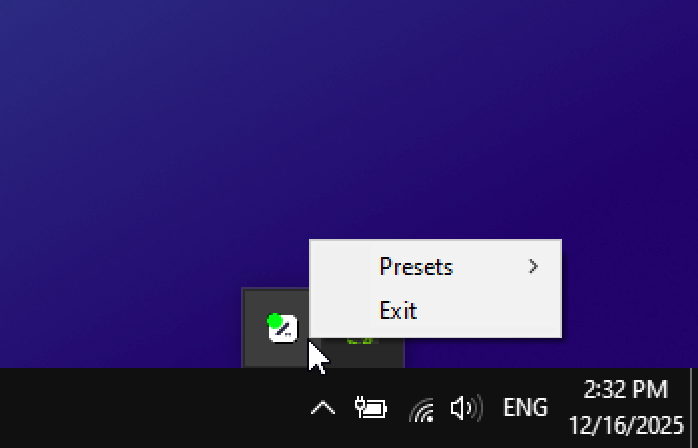

**tabd** – minimal userspace driver for drawing tablets.



### Developing

Compile using MSVC with 64-bit prompt enabled (32-bit evironment is **not** supported):
```bat
rc /nologo /i src /fo icon.res res\icon.rc
cl /nologo src\tabd.c src\tablet.c src\util.c src\preset.c icon.res /link /subsystem:windows /entry:_start
```

Running in the terminal:
```bat
start /b /wait tabd.exe
```

Delete intermediate files:
```bat
del /q /s /f *.exe *.obj *.zip *.ilk *.res *.pdb *.rdi 1> nul
```

### Configuring presets

Preset settings are specified in [`src/preset.c`](src/preset.c#L3) file:
```c
const Preset g_presets[] = {
    { L"Drawing", { {108, 67.5},    {216, 135},        0 } },
    { L"Osu",     { {80.41049, 86}, {98, 55.098095}, -90 } },
};
```

`Preset` type is defined in [`src/preset.h`](src/preset.h#L13):
```c
typedef struct {
    Vec2 center;
    Vec2 size;
    float rotation;
} ActiveArea; 

typedef struct {
    PCWSTR name;
    ActiveArea area;
} Preset;
```

Currently, preset values can not be changed at runtime.

They use the same values [OpenTabletDriver][otd] does except that the first pair of values 
(`{108, 67.5}`) is preset center's **XY** coords and the second pair (`{216, 135}`) is the **size** 
of the area. Both pairs of values are in millimeters while rotation is in degrees.

Unlike in OTD, display area to which the tablet area is mapped to can not be configured.

The first preset in the list is used by default but can be changed by right-clicking on the tray 
icon and selecting another preset under "Presets" submenu.

[otd]: https://github.com/OpenTabletDriver/OpenTabletDriver

### Tablet Support

tabd uses the same machinery as [HidSharpCore][hidsharp] – one of OpenTabletDriver's dependencies.

To add support for new tablets see [`tablet.c`](src/tablet.c) and, if you want, OpenTabletDriver's
[parsers][wacom-parser] and [configurations][ctl672.json] for tablets it supports.

For now, only Wacom CTL-672 tablet is supported.

[hidsharp]: https://github.com/InfinityGhost/HIDSharpCore
[wacom-parser]: https://github.com/OpenTabletDriver/OpenTabletDriver/blob/master/OpenTabletDriver.Configurations/Parsers/Wacom/PTU/PTUTabletReport.cs
[ctl672.json]: https://github.com/OpenTabletDriver/OpenTabletDriver/blob/master/OpenTabletDriver.Configurations/Configurations/Wacom/CTL-672.json
